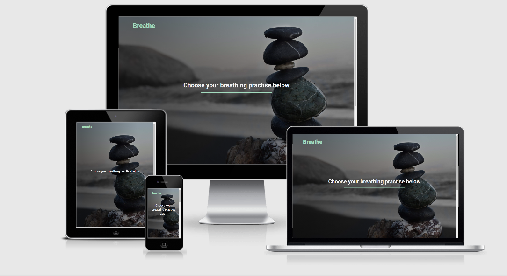

--- 

This project was created for my second Milestone Project with Code Institute in order to display my knowledge and understanding 
of HTML, CSS, Bootstrap and JavaScript.

I wanted this project to be completely different from my MS1. I also thought why not create something that lots of people would use on a daily basis.
I know there are already a few breathing / meditation apps but I don't think there are many with a simple single page interface with 
minimal distractions from the task at hand: to breathe.

---
## Table of Contents
* [User Experience Design (UX)](#User-Experience)
    * [The Strategy Plane](#The-Strategy-Plane)
    * [User stories](#User-Stories)
    * [Design](#Design)
        * [Font](#Font)
        * [Images](#Images)
        * [Colour Scheme](#Colour-Scheme)
        * [Logo](#Logo)
        * [Wireframes](#Wireframes)
* [Features](#Features)
    - [index.html Page](#index.html-Page)
    - [Modal](#Modal)
    - [Future Features to Implement](#future-features-to-implement)
* [Technologies Used](#Technologies-Used)
* [Testing](#testing)
    - [Responsivity across devices](#responsivity-across-devices)
    - [HTML CSS and JavaScript Testing](#html-css-and-javascript-testing)
    - [User Stories](#user-stories)
    - [Manual Testing](#manual-testing)
 * [Issues and Solutions](#issues-and-solutions)   
* [Deployment](#deployment)
    * [Initial Creation](#initial-creation)
    * [Deployment via GitHub](#deployment-via-github)
* [Credits](#credits)
    * [Content](#content)
    * [Media](#media)
    * [Acknowledgements](#acknowledgements)

--- 

## User Experience
 This website will target a wide range of people that are looking for different things from this website; some will want it for stres reduction, others to enhance their concentration and performance,
  while some may just want to take a few minutes to relax. The main focus of this site will be to get them started with their breathing exercise of choice so this will be the focus of the site.

---

### User Stories

- As a user, I want to understand the use of the website straight away.
- As a user, I want to be able to easily navigate throughout the site.
- As a user, I want to be informed about the breathing techniques before I pick the one I wish to practise.
- As a user, I want to decide when my practise starts.
- As a user, I want to be able to stop my practise.
- As a user, I want to control whether the practise is played in fullscreen mode to allow for a breathing session with even less distractions
- As a user, I want calming colours to help me relax.
- As a user, I want to be able to change my selection of breathing technique even after my practise has begun.
- As a user, I want to see social media links so I can learn more about the company on a separate page.

---
### The Strategy Plane
This project was created to show the skills I have acquired in Javascript and jQuery since completing my MS1 and to provide all users a means of taking a time out from their hectic 
lives to focus on their breathing for a set amount of time.

The site will have different breathing techniques available to the users, each with a brief description of the practise and its benefits. This website will have a simple interface 
and will be easy for the user to interact with to make their selection and begin their practise. 

After they choose their breathing method, the practise will begin and the countdown in seconds for each breathing promt eg: inhale, hold etc, and each breathing promt 
will be displayed on the screen.

---
## Design
### Font 
Using the <a href="https://fontpair.co/">Font Pair</a> website, I chose two complimentary fonts; <a href="https://fonts.google.com/specimen/Asap">Asap</a> 
for the headings, and <a href="https://fonts.google.com/specimen/Roboto">Roboto</a> for the rest of the text.

--- 
### Images
The sites only image is the hero image which takes up 100% of the width and 100vh. The image is a photo from the beach with rocks balancing on top of one another which should bring the users 
a sense of calm and peace.

---
### Colour Scheme
The colours used in the website will be:
-   `#F3F3F3` 
-  `#202020`
-  `#3C403D`
-  `#a3dcbe`
-  `#DADED4`

---
### Logo
Using the colour  `#a3dcbe` and the font <a href="https://fonts.google.com/specimen/Roboto">Roboto</a> with font-weight 800, I created the font logo "Breathe".   

---
### Wireframes 
Using <a href="https://balsamiq.com/">Balsamiq</a>, I created my wireframes for my website. 

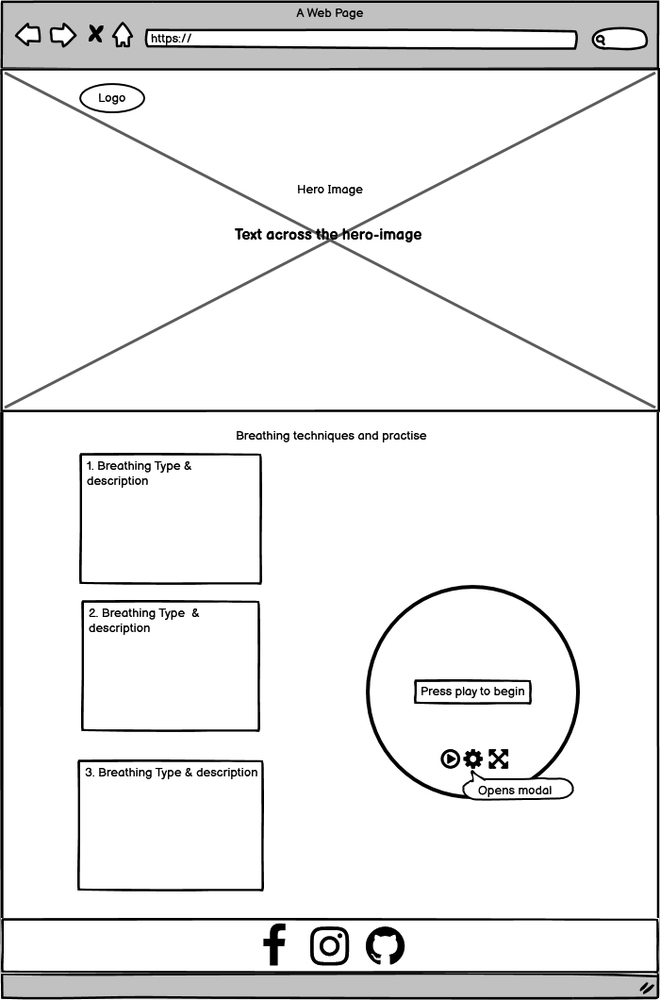
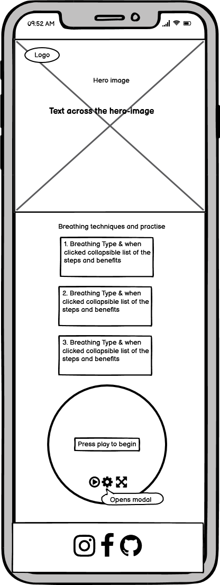

 Alternatively you can view the wireframes [here](assets/images/wireframes).  
 
#### Differences to Wireframes
The original wireframes can be viewed [here](assets/images/oldWireframes). The new wireframes adapted a single page approach for this web app. 
A custom 404 error page was added with an anchor link which the user can click and be redirected to the index.html page Even though this a single page application the 404.html is created for 
users who somehow direct to a non-existent page such as [this](https://shielh.github.io/breathe-MS2/hello)

 ---
## Features
### index.html Page
- Transparent header containing site logo on top Left corner
- Hero image taking up 100vh and 100% of the width
- Dark overlay on hero image to make text easier to read
- Transparent jumbotron in the centre of the hero image with text
- Under the hero image, there is a heading and three text areas detailing the three set breathing practises 
- Circlular shape containing breathing prompts and seconds remaining for each prompt(once the practise has begun)
- Play and stop buttons in the circle to control the breathing exercise
- Settings button to bring you to modal box with the breathing options
- Fullscreen icon to allow you to toggle in and out of fullscreen mode
- Footer to include social media links to open in separate tab

 ### Modal
- Modal content to include radio buttons to make choice of breathing technique
- Fourth radio button is custom choice which when selected gives drop down range sliders for inhale, hold, exhale and second hold times
- Modal content to include "let's start" button to start breathing exercise on index.html page (with same function as the start button on the breathe circle)
- Modal to include "exit" button to return to index.html page when clicked

### Future Features to Implement
- Add animations to increase the size of the circle on inhale, the increased size to remain for the first hold, the cirlce to decrease to its origanal size throught the exhale and to remain the smaller 
size for the second hold.
- Add an option to sign up to "Breathe" where you can enter how often you would like to practise and set up alerts to remind you at the chosen time of day
- Add soft, soothing music to play while the breathing practise is in session that can be switched on and off by the user

---
## Technologies Used

- [HTML5](https://en.wikipedia.org/wiki/HTML5) 
    - The project uses **HTML** as the main language for structuring the content
- [CSS3](https://en.wikipedia.org/wiki/CSS) 
    - The project uses **CSS** for styling the sites content
- [Javascript](https://www.javascript.com/)
    - The project uses **Javascript** to control the behaviour of the site
- [JQuery](https://jquery.com)
    - The project uses **JQuery** to simplify DOM manipulation.
- [GitHub](https://github.com/) 
    - This is the hosting site where I first created the repository for this webpage and also where the live site is deployed from 
- [Git](https://git-scm.com/) 
    - This is the version control software used where can I commit and push the updated information to the hosting website GitHub
- [Bootstrap](https://getbootstrap.com/) 
    - This was used Bootstrap to help in the design and layout of the website in conjunction with HTML, CSS and Javascript
- [Font Awesome](https://fontawesome.com/) 
    - This was used to collect the social media icons for this site
- [Balsamiq](https://balsamiq.com/) 
    - This was used to create my rough wireframes
- [Google Fonts](https://fonts.google.com/) 
    - This was used to import the two fonts for this site, Asap and Roboto
- [Free Logo Design](https://www.freelogodesign.org/) 
    - This was used to create the site logo
- [Font Pair](https://fontpair.co/) 
    - This was used to choose complementary fonts
- [Tiny JPG](https://tinyjpg.com/) 
    - This was used this to compress my images

---
## Testing

### Responsivity across devices
- I checked the site across [Google Chrome](https://www.google.com/intl/en_ie/chrome/), [Mozilla Firefox](https://www.mozilla.org/en-US/firefox/new/), [Safari](https://www.apple.com/safari/) 
and [Opera](https://www.opera.com/) and all pages were completely responsive  with the layout remaining intact, with the exception of [Mozilla Firefox](https://www.mozilla.org/en-US/firefox/new/) where the button in the 
jumbotron appeared elongated.
- Using [Chrome DevTools](https://developers.google.com/web/tools/chrome-devtools), (to open I right-clicked anywhere on my website and clicked "Inspect" or clicked "F12" on the keyboard), I ran my site in mobile/tablet display 
across the following devices: Galaxy Note 3, Galaxy S III, Moto G4, iPhone 4, Galaxy S5, Pixel 2, Pixel 2 XL, iPhone 5/SE, iPhone 6/7/8, iPhone 6/7/8 Plus, iPhone X, iPad, iPad Pro. Everything 
ran normally on these devices. I also sent my site to some friends and family to open on their phones. One issue that I got feedback on was that the dark overlay wasn't filling the entire hero-image 
so i changed the vh to 100 and the width to 100% for the overlay styling and this fixed this issue. Please see image below to see the issue:

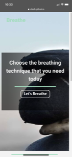

---
### HTML CSS and JavaScript Testing
1. W3C HTML Validator
- I opened [W3C HTML Validator](https://validator.w3.org/) and selected the "Validate by Direct Input" option and pasted the index.html content in, clicked "Check" and was greeted with the following 
message "Document checking completed. No errors or warnings to show."

2. Similarly, I ran the code through the [W3C CSS Validator](https://jigsaw.w3.org/css-validator/) 
- I selected the "by Direct Input" option and pasted my style.css and responsive.css code in
- I received the message "Congratulations! No Error Found" on both entries.

3. Finally, I ran the code through the [JSHint Validator](https://jshint.com/) 
- I deleted the code on the left hand side of the screen and pasted my index.js code in, then clicked configure
- I received three of the same warnings "Unnecessary semicolon" which disappeared when I deleted the semicolons and ran the code through again.

---
### User Stories
- As a user, I want to understand the use of the website straight away.
    - From the image below, we can see we are greeted with a large image with text in the center when the page loads. The text says "Choose your breathing practise below".
    This tells us straight away what the page is for and it is emphasised by the "Breathe" logo in the top left-hand corner.

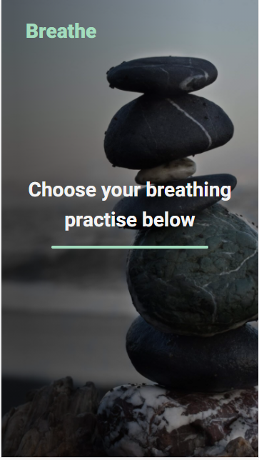

- As a user, I want to be able to easily navigate throughout the site.
- As a user, I want to be informed about the breathing techniques before I pick the one I wish to practise.
    - The image below shows us the rest of the index.html page when we scroll down from the hero image. We can see there are two sections. On desktop, the breathing technique descriptions 
    are shown on the left and the breathing practise circle is shown on the right. In mobile view, the breathing practise circle is shown beneath the heading and the techniques are listed underneath.

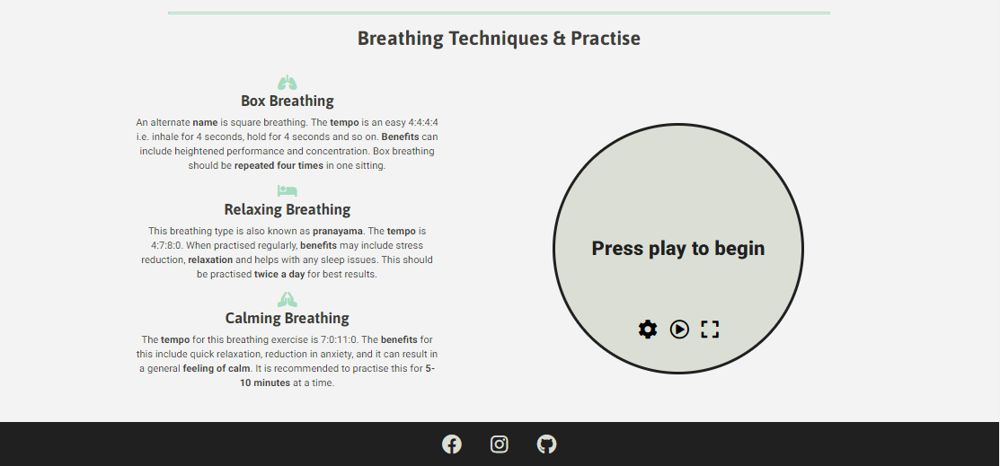 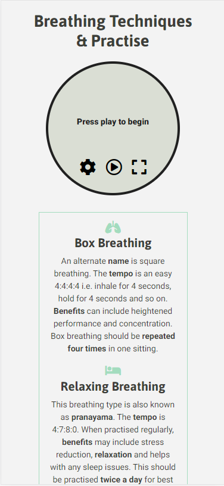    
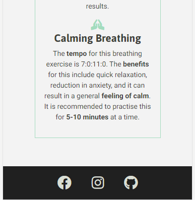

- As a user, I want to decide when my practise starts.
- As a user, I want to be able to stop my practise.
    - We can see below that the breathing circle has various buttons so the user can control when they start, by clicking the play button, Only after clicking the play 
    button does the stop button appear which can be pressed to stop or reset the practise. 

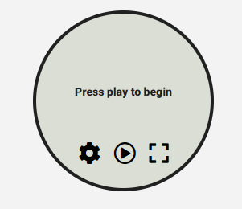 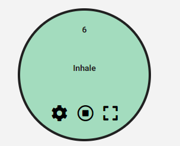

- As a user, I want to control whether the practise is played in fullscreen mode to allow for a breathing session with even less distractions 
    - The fullscreen button is to the right of the play button. As you can see from the image below, this allows the user to really concentrate on their breathing without the distraction of 
    the breathing techniques text. I have added text when you hover over the settings button explaining the modal does not open when in fullscreen mode so the user will have to exit fullscreen 
    to change their breathing practise choice 

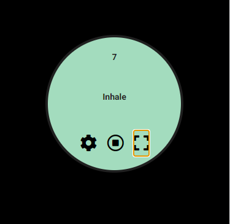

- As a user, I want calming colours to help me relax.
    - As can be seen in the images above of the site, calm green colours have been chosen which have been shown to instill a sense of calm and relaxation into people. Different shades of green 
    are also used when the startBreathing function is called with deeper greens for the inhale and exhale part of the exercise and a lighter green for the holds

- As a user, I want to be able to change my selection of breathing technique even after my practise has begun.
    - The settings button on the breathing circle (when clicked) opens up the modal which can be seen below. The user can make their selection here or if they just select play the default 
    box breathing exercise will begin. 

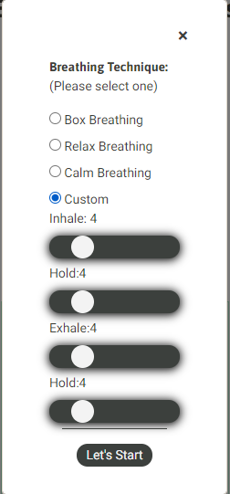

- As a user, I want to see social media links so I can learn more about the company on a separate page.
    - In the footer of the page, three social icons are displayed which when clicked will open a new tab and direct you to the appropriate pages. The image below is in mobile view 

### Manual Testing
- Header
    - Located at the top of the screen on all devices
    - Breathe icon visible on top left of the screen 

- Footer
    - Located at the bottom of the screen on all devices
    - Social icons display in a horizonal row
    - Social icons:
        - Note when you hover over each, it changes colour 
        - Click on each icon
        - Links open in new tab
        - Correct social media page is opened for each

- Hero-image
    - Displayed at the top of the page taking up 100vh and 100% width 
    - Transparent jumbotron with big text in the center

- Breathing Techniques and Practise
    - Three pieces of text stacked with details of the relevant breathing techniques. 
    - Breathing practise circle
        - Play button 
            - Hover over the button and observe the text "Click to stop"
            - On click:
                - Displays text "Ready?" "Lets go!"
                - Starts the breathing practise i.e calls the startBreathing function
                - Disables stop and setting button for 2.5 seconds
                - Hides the play button and shows the stop button 

        - Settings button
            - Hover over the button and observe the text "Click to change technique."
            - On click:
                - Calls the clearInterval function
                - Hides the stop button and shows the start button
                - Opens the modal with breathing choices
                - Returns breathe circle colour to  
                - Changes span where countdown is back to being empty
                - Changes span with breathing prompts to display "Press play to begin"

        - Stop button
            - Hover over the button and observe the text "Click to stop"
            - On click:
                - Calls the clearInterval function
                - Hides the stop button and shows the start button
                - Returns breathe circle colour to  
                - Changes span where countdown is back to being empty
                - Changes span with breathing prompts to display "Press play to begin"

        - Fullscreen button
            - Hover over the button and observe the text "Click for fullscreen. Cannot open settings in fullscreen"
            - On click:
                - Toggles fullscreen mode

        - Modal
            - Shows the different breathing techniques with radio buttons beside each
            - On click:
                - Box breathing radio button and "Let's Start" button, the box breathing technique begins
                - Relax breathing radio button and "Let's Start" button, the relax breathing technique begins
                - Calm breathing radio button and "Let's Start" button, the calm breathing technique begins
                - Custom breathing radio button, reveals sliders for time needed for inhale, hold, exhale and a second hold
                    - When you slide to your preferred time(in seconds) for each and press the "Let's Start" button, the custom breathing technique begins
                - Close button in top right hand corner causes  custom values to be hidden
                - Radio buttons for box, relax and calm also cause the custom radio options to be hidden (if it was previously selected)
                - Slider also displays value range of 0-20 above the slider to show the user the amount of seconds they are deciding to practise
        - Let's Start button 
            - On click:
                - Displays text "Ready?" "Lets go!"
                - Initiates the breathing practise i.e calls the startBreathing function
                - Disables stop and setting button for 2.5 seconds
                - Hides the play button and shows the stop button 

---
## Issues and Solutions
- An issue I ran into when implementing the toggle fullscreen function was that the shape of the circle expanded to fit the height and width of the device. I researched this a lot to find a solution 
and came across a thread on [StackOverflow](https://stackoverflow.com/questions/3276226/how-to-make-a-full-screen-div-and-prevent-size-to-be-changed-by-content) which I have reference below in the 
content section
- Another issue I faced throughout the course of this project was to do with the setTimeout and setInterval functions. I wanted text to appear saying "Ready?" and "Let's go" and I achieved this by 
using a setTimeout function before the setInteral for the startBreathing function was called. This meant if I clicked stop or settings button before the first inhale, it wasn't calling the clearTimeout  
and the setInteral function hadn't been called yet. To overcome this, I set a 2.5 second disable button function on the stop button and the settings button. Another way of solving this issue 
would have been to include the 2.5 seconds in the getBreathText calculations
- 

---
## Deployment

### Initial Creation
Breathe was first created by completing the following steps on GitHub:
1. Open [Github](https://github.com/) page up in browser
2. Log in using your username and password
3. Click the "New" green button to the left-hand side repository section
4. Click template dropdown menu and select the "Code Institute Full Template"
5. Enter name of project "breathe-MS2"
6. Click "Create repository"
7. Click the green "Gitpod" button ONCE to redirect to the Gitpod workspace
8. Open via [Gitpod Workspaces](https://gitpod.io/workspaces/) only from then on

Throughout development, three primary commands were used with the CLI [Git](https://git-scm.com/) and were as follows :

- "git add" followed by the file name you wish to stage or "git add ." stages all unstaged files
- "git commit -m" followed by a detailed comprehensive comment pertaining to the changes made since the previous commit
- "git push" makes all changes visible on the GitHub Repo

### Deployment via GitHub
1. Open [Github](https://github.com/) page up in browser
2. Log in using your username and password
3. Select "shielh/breathe-MS2" from repositories displayed on left-hand side of screen
4. Click "settings", the last option displayed in the navigation menu
5. Scroll down until you reach "GitHub Pages" section
6. Select "Master Branch" in the dropdown under the Source heading
7. Finally, click to confirm my selection
8. A live version of Breathe is now live on Github [here](https://shielh.github.io/breathe-MS2/)

### Running Locally
1. Open [Github](https://github.com/) and navigate to the [repository](https://github.com/shielh/breathe-MS2)
2. Click the green "code" button and select either "clone" or "download"
3. The "clone" option will provide you with a URL which can be used from your IDE of choice where you can use the "git clone" command in the terminal followed by the URL
4. Alternatively, the "download" ZIP option gives you a link to download a ZIP file which you can then unpackage locally and open with an IDE and run index.html
---
## Credits
---
### Content
- The setInteral() and clearInterval() functions were created with the help of this [YouTube tutorial](https://www.youtube.com/watch?v=ubLC1JxMqfY).
- The custom slider was created with the guidance of this [YouTube tutorial](https://www.youtube.com/watch?v=BrpiNUf2XCk).
- The toggle fullscreen function was created with the help of this [YouTube tutorial](https://www.youtube.com/watch?v=3FjYcMKZ3SU).
- The CSS code to prevent the circle shape from distorting and enlarging in fullscreen was taken from [StackOverflow](https://stackoverflow.com/questions/3276226/how-to-make-a-full-screen-div-and-prevent-size-to-be-changed-by-content)
- The CSS code for making the "breathe" logo visible with the hero-image behind was styled using information from [StackOverflow](https://stackoverflow.com/questions/56521316/how-do-i-overlay-a-transparent-navbar-over-a-hero-image-and-have-a-functioning-b)
- The code for the 404.html page was created with the help of this [YouTube tutorial](https://www.youtube.com/watch?v=PbKOX2tkHlI)
---
### Media
- The photos used on this site were obtained from [Unsplash](https://unsplash.com/).
---
### Acknowledgements
I would like to thank:
- My brother Gregory for his patience in answering my JavaScript related questions. 
- My mentor Rohit Sharma for his guidance throughout this project.
- My peers in various Slack channels for always getting back to me quickly with questions or feedback.

---