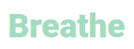

# Breathe

This project was created for my second Milestone Project with Code Institute in order to display my knowledge and understanding 
of HTML, CSS, Bootstrap, JavaScript and Jasmine Testing.

I wanted this project to be completely different from my MS1 and something that lots of people would use on a daily basis.

## Table of Contents
* [User Experience Design (UX)](#User-Experience)
    * [The Strategy Plane](#The-Strategy-Plane)
    * [User stories](#User-Stories)
    * [Design](#Design)
        * [Font](#Font)
        * [Colour Scheme](#Colour-Scheme)
        * [Logo](#Logo)
        * [Wireframes](#Wireframes)
    * [Features](#Features)
        * [index.html Page](#index.html-Page)
        * [breathe.html Page](#breathe.html-Page)
        * [Modal](#Modal)

 
## User Experience
 This website will target a wide range of people that are looking for different things from this website; some will want it for stres reduction, others to enhance their concentration and performance,
  while some may just want to take a few minutes to relax. The main focus of this site will be to get them started with their breathing exercise of choice so there won't be a lot of content to take 
  away from that.

### The Strategy Plane
This project was created to show the skills I have acquired in Javascript and jQuery since completing my MS1 and to provide all users a means of taking a time out from their hectic 
lives to focus on their breathing for a set amount of time.

The site will have different breathing techniques available to the users, each with a brief description of the practise and its benefits. This website will have a simple interface 
and will be easy for the user to interact with to make their selection.

After they choose their breathing method and the time they wish to practise for, they will begin and the counting for inhalation and exhalation will be displayed on the screen.

// Use this section to provide insight into your UX process, focusing on who this website is for, what it is that they want to achieve and how your project is the best way to help them achieve these things.
### User Stories

- As a user, I want to understand the use of the website straight away.
- As a user, I want to be able to easily navigate throughout the site.
- As a user, I want to be informed about the breathing techniques before I pick the one I wish to practise.
- As a user, I want to decide when my practise starts.
- As a user, I want to be able to pause my practise.
- As a user, I want to decide how long I practise my breathing for.
- As a user, I want calming colours and images to help me relax.
- As a user, I want to be able to change my selection of breathing technique and/or timing even after my practise has begun.
- As a user, I want to see social media links so I can learn more about the company on a separate page.
- As a user, I want to control whether music is played or not during the breathing practise.

## Design
### Font 
Using the <a href="https://fontpair.co/">Font Pair</a> website, I chose two complimentary fonts; <a href="https://fonts.google.com/specimen/Asap">Asap</a> 
for the headings, and <a href="https://fonts.google.com/specimen/Roboto">Roboto</a> for the rest of the text.

### Colour Scheme
The colours used in the website will be #F3F3F3 (white), #202020 (black), #3C403D (brown grey), #a3dcbe (green cyan) and #DADED4 (Tanly)

### Logo
Using the colour #a3dcbe and the font Roboto with font-weight 800, I created the font logo "Breathe".   

### Wireframes 
Using <a href="https://balsamiq.com/">Balsamiq</a>, I created my wireframes for my website. 

This section is also where you would share links to any wireframes, mockups, diagrams etc. that you created as part of the design process. These files should themselves either be included as a pdf file in the project itself (in an separate directory), or just hosted elsewhere online and can be in any format that is viewable inside the browser.

## Features
### index.html Page
- Transparent header containing site logo on top Left
- Hero image taking up 100vh 
- Transparent jumbotron in the centre of the hero image with text and button leading to breathe.html page 
- Under the hero image, heading and three text areas detailing the different breathing practises 
- An image in the breathing techniques container
- Footer to include social media links to open in separate tab

### breathe.html Page
- Site logo which contains an anchor tag to the index.html page
- Circle with breathing prompts
- Play/ pause button in the circle to control the breathing exercise
- Settings button to bring you to modal box

 ### Modal
- Modal content to include radio buttons to make choice of technique
- Fourth radio button is custom choice which when selected gives drop down range sliders for inhale, hold, exhale, hold
- Modal content to include submit button to start breathing exercise on breathe.html page
- Modal to include "exit" button to return to breathe.html page

### Existing Features
- Feature 1 - allows users X to achieve Y, by having them fill out Z
- ...

For some/all of your features, you may choose to reference the specific project files that implement them, although this is entirely optional.

In addition, you may also use this section to discuss plans for additional features to be implemented in the future:

### Features Left to Implement
- Another feature idea

## Technologies Used

In this section, you should mention all of the languages, frameworks, libraries, and any other tools that you have used to construct this project. For each, provide its name, a link to its official site and a short sentence of why it was used.

- [HTML5](https://en.wikipedia.org/wiki/HTML5) 
    - The project uses **HTML** as the main language for structuring the content
- [CSS3](https://en.wikipedia.org/wiki/CSS) 
    - The project uses **CSS** for styling the sites content
- [Javascript](https://www.javascript.com/)
    - The project uses **Javascript** to control the behaviour of the site
- [JQuery](https://jquery.com)
    - The project uses **JQuery** to simplify DOM manipulation.
- [GitHub](https://github.com/) 
    - This is the hosting site where I first created the repository for this webpage and also where the live site is deployed from 
- [Git](https://git-scm.com/) 
    - This is the version control software used where can I commit and push the updated information to the hosting website GitHub
- [Bootstrap](https://getbootstrap.com/) 
    - This was used Bootstrap to help in the design and layout of the website in conjunction with HTML, CSS and Javascript
- [Font Awesome](https://fontawesome.com/) 
    - This was used to collect the social media icons for this site
- [Balsamiq](https://balsamiq.com/) 
    - This was used to create my rough wireframes
- [Google Fonts](https://fonts.google.com/) 
    - This was used to import the two fonts for this site, Asap and Roboto
- [Free Logo Design](https://www.freelogodesign.org/) 
    - This was used to create the site logo
- [Font Pair](https://fontpair.co/) 
    - This was used to choose complementary fonts
- [Tiny JPG](https://tinyjpg.com/) 
    - This was used this to compress my images

## Testing

In this section, you need to convince the assessor that you have conducted enough testing to legitimately believe that the site works well. Essentially, in this part you will want to go over all of your user stories from the UX section and ensure that they all work as intended, with the project providing an easy and straightforward way for the users to achieve their goals.

Whenever it is feasible, prefer to automate your tests, and if you've done so, provide a brief explanation of your approach, link to the test file(s) and explain how to run them.

For any scenarios that have not been automated, test the user stories manually and provide as much detail as is relevant. A particularly useful form for describing your testing process is via scenarios, such as:

1. Contact form:
    1. Go to the "Contact Us" page
    2. Try to submit the empty form and verify that an error message about the required fields appears
    3. Try to submit the form with an invalid email address and verify that a relevant error message appears
    4. Try to submit the form with all inputs valid and verify that a success message appears.

In addition, you should mention in this section how your project looks and works on different browsers and screen sizes.

You should also mention in this section any interesting bugs or problems you discovered during your testing, even if you haven't addressed them yet.

If this section grows too long, you may want to split it off into a separate file and link to it from here.

## Deployment

This section should describe the process you went through to deploy the project to a hosting platform (e.g. GitHub Pages or Heroku).

In particular, you should provide all details of the differences between the deployed version and the development version, if any, including:
- Different values for environment variables (Heroku Config Vars)?
- Different configuration files?
- Separate git branch?

In addition, if it is not obvious, you should also describe how to run your code locally.

## Credits

### Content
- The text for section Y was copied from the [Wikipedia article Z](https://en.wikipedia.org/wiki/Z)

### Media
- The photos used in this site were obtained from ...

### Acknowledgements

- I received inspiration for this project from X